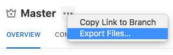

# `fds-icons`
Icon library for Form Design System

## Getting Started

### Usage

#### As a React component (recommended)
```
import CloudIcon from '@cbinsights/fds/lib/icons/react/CloudIcon';

const UploadButton = () => {
  <button>
    <CloudIcon />
    Upload yourself to the cloud
  </button>
};
```

Every Icon component from `fds-icons` accepts the following props:

Prop        | Type     | Default | Description
----------- | -------- | ------- | -----------------
`color`     | `String` | `COLOR_CHARCOAL` | Color of `fill` for SVG
`size`      | `xs`,`s`,`m`,`l`,`xl` | `s` | Standard media size of icon
`className` | `String` |         | custom class name

#### As raw SVG
```
import cloudSvg from '@cbinsights/fds/lib/icons/svg/Cloud.svg';
```

#### As raw PNG

FDS provides PNGs scaled to 1x, 2x, 3x, and 4x.
The base icon name is scaled to 1x. Specify higher res images with the `@scale` suffix:

- `Cloud.png` (1x)
- `Cloud@2x.png` (2x)

```
import cloudPng from '@cbinsights/fds/lib/icons/png/Cloud@2x.png';
```


------

## Development

### Updating icons from a Sketch file
This project uses `sketchtool` to export SVG icons directly from a sketch file provided by the design team. You must have [Sketch](https://www.sketchapp.com/) installed in order to run the export command.

#### 1) Setting up `sketchtool`
If you don't already have `sketchtool` on your system, follow these steps:

1. Install [Sketch](https://www.sketchapp.com/)
2. Add the `sketchtool` binary to your PATH:

```bash
export SKETCHTOOL_PATH="/Applications/Sketch.app/Contents/Resources/sketchtool/bin"
export PATH=$PATH:SKETCHTOOL_PATH
```

#### 2) Getting the icons sketch file
Our design team is now using [Abstract](https://app.goabstract.com/organizations/0bd48624-8826-4447-a082-1957932b89b8/projects)
to version Sketch files for the design system. To pull down the latest `Icons.sketch` file...

1. Ask the design team for credentials to [our project](https://app.goabstract.com/organizations/0bd48624-8826-4447-a082-1957932b89b8/projects)
2. Download the Abstract desktop app
3. In the desktop app, navigate to "CB Insights Design System"
4. Select `Master` in the sidebar
5. Select "Export files" from the kebab menu



##### Known issues
- Icons should be contained in _exportable artboards_
- Icon artboards should be named with prefix `icon/`
- No two icons should be named the same thing. The export script will helpfully
  throw an error if any duplicates are detected.

#### 3) Running the export
This project uses a node script to automate `sketchtool` commands.
Run it **from the root of the `form-design-system` repo**.

```
yarn icons:export <path to sketch file>
```

This will export SVG files to `packages/fds-icons/src/`.

#### Verifying changes
A good way to verify icons exported as expected is to run a build on the icons package and check the regenerated docs.

```
yarn build:icons
```

Once the build is complete you can open `docs/fds-icons/index.html` in a browser to see
changes/additions to the icon set.

#### 4) Bump the version number
When adding or changing icons, please bump the **minor** version number for FDS. When removing
icons, bump the **major** version number.
